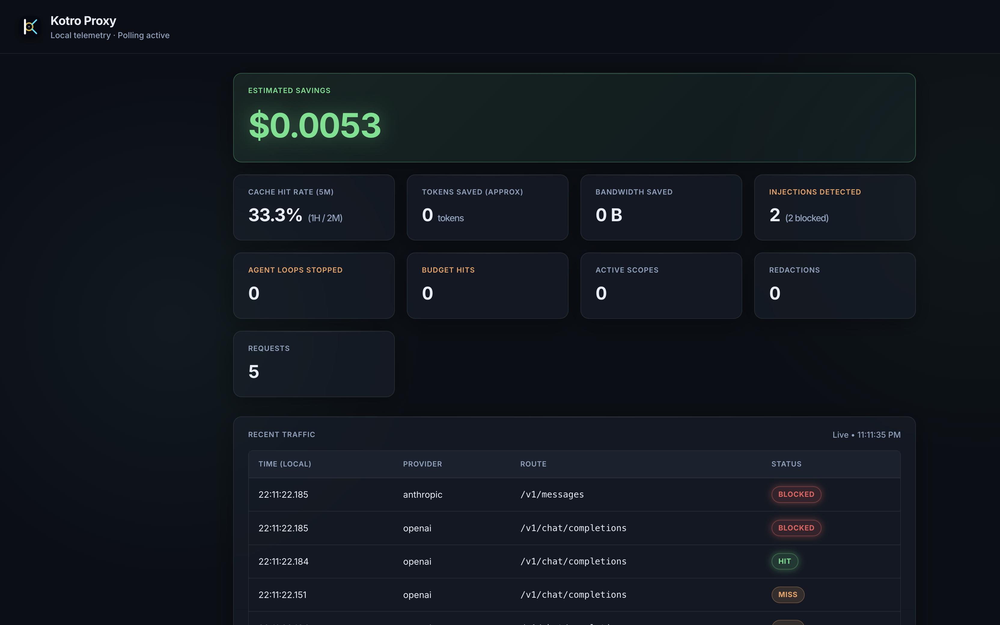

# Kotro

<p align="center">
  
</p>

<p align="center">
  <strong>Local coding-agent control plane — MCP action governance + LLM-path protection + cost control, one binary.</strong>
</p>

<p align="center">
  Open source · no SaaS · replayable evidence. For Claude Code, Cursor, Continue, and Cline — not a general org gateway.
</p>

<p align="center">
  <a href="https://github.com/kotro-labs/kotro-proxy-engine/actions/workflows/ci.yml"></a>
  <a href="https://github.com/kotro-labs/kotro-proxy-engine/releases"></a>
  <a href="https://www.npmjs.com/package/@kotro-labs/proxy-engine"></a>
  <a href="https://marketplace.visualstudio.com/items?itemName=kotrolabs.kotro-proxy-engine"></a>
  <a href="LICENSE"></a>
</p>

<p align="center">
  <a href="docs/launch/assets/exploit-demo-recording.mp4"><strong>▶ 78s demo (narrated)</strong></a>
  ·
  <a href="docs/launch/assets/exploit-demo-recording-silent.mp4">silent</a>
  ·
  <a href="docs/launch/assets/dashboard-injection-demo.png">dashboard screenshot</a>
  ·
  <a href="docs/launch/exploit-demo.md">exploit guide</a>
</p>
<p align="center">
  <sub>Local dashboard (after start): <code>http://127.0.0.1:9090/dashboard</code></sub>
</p>

<p align="center">
  <a href="docs/launch/assets/dashboard-injection-demo.png">
    
  </a>
</p>

### Who this is for

- You want **one local control plane** for coding agents: govern **MCP tool actions** and **LLM provider traffic** under the same `KOTRO_MODE` dial
- You run **Claude Code**, **Continue.dev**, **Cline**, or any agent that can set a **localhost** base URL
- You use **Cursor** for Verify Cache / dashboard locally — Cursor Chat needs an HTTPS bridge (Cursor’s cloud cannot call `localhost`)
- You care about **evidence** (flight recorder + [Escape Lab](docs/security/ESCAPE-LAB-MATRIX.md)), not just a features checklist

### Two planes, one dial

```text
  Coding agent
       │
       ├── MCP action plane ── mcp-wrap ──► MCP servers
       │     schema pin · TaskEnvelope · argument admission · approvals
       │
       └── LLM plane ────────── proxy ────► OpenAI / Anthropic / …
             injection scan · redaction · cache · budget · circuit breaker

  Shared: KOTRO_MODE (disabled|audit|enforce) · kill switch (outranks mode) · flight recorder
```

| Control | What it does |
|---------|----------------|
| **`mcp-wrap`** | Pins tool schemas, quarantines drift, validates `tools/call` args, optional TaskEnvelope authority |
| **LLM proxy** | Scans/redacts provider HTTP (`/v1/chat/completions`, `/v1/messages`); OpenAI ⇄ Anthropic translation |
| **`KOTRO_MODE`** | `disabled` / `audit` / `enforce` on both planes; kill switch still halts when engaged |
| **Flight recorder** | Local tape of decisions — export from `:9090` |
| **Escape Lab** | CI-gated adversarial corpus — see honesty note below |
| **Permit (alpha)** | Fail-closed `run --permit`: Docker sandbox + signed envelope + Option A stage → apply / thin draft-PR broker — [claims](docs/launch/PERMIT-ALPHA-CLAIMS.md) |

### 30-second install

```bash
curl -sL https://raw.githubusercontent.com/kotro-labs/kotro-proxy-engine/main/scripts/install.sh | bash
KOTRO_UPSTREAM_URL=https://api.openai.com KOTRO_UPSTREAM_API_KEY=$OPENAI_API_KEY kotro-proxy
# Point agents that call from YOUR machine at http://127.0.0.1:8080/v1
# Dashboard: http://127.0.0.1:9090/dashboard
```

For real provider traffic set `KOTRO_UPSTREAM_URL` + your API key (as above). **No API key?** Skip to [See it yourself](#see-it-yourself-no-api-key) (`make demo-injection`).

| Also | |
|------|--|
| **Homebrew** | `brew install kotro-labs/tap/kotro-proxy` |
| **npm** | `npm i -g @kotro-labs/proxy-engine` |
| **Docker** | `docker run --rm -p 8080:8080 -p 9090:9090 -e KOTRO_UPSTREAM_URL=https://api.openai.com -e KOTRO_UPSTREAM_API_KEY=$OPENAI_API_KEY ghcr.io/kotro-labs/kotro-proxy:0.6.3` *(linux/amd64)* |
| **Cursor / VS Code** | [Marketplace extension](https://marketplace.visualstudio.com/items?itemName=kotrolabs.kotro-proxy-engine) (SHA-256–verified download; Setup Wizard is opt-in) |

### Which client works how

Cursor **Chat / Agent** does **not** dial your laptop. Override Base URL is invoked from **Cursor’s cloud**, which **blocks private IPs** (`localhost` → *Access to private networks is forbidden*). That is Cursor’s SSRF policy — not a Kotro bug.

| Client | Calls from | Works with Kotro | Setup |
|--------|------------|------------------|--------|
| **Continue.dev** | IDE process | ✅ Direct `localhost` | Setup Wizard (opt-in) |
| **Cline** | IDE process | ✅ Direct `localhost` | Setup Wizard (opt-in) |
| **Claude Code** | Your terminal | ✅ Direct `localhost` | `ANTHROPIC_BASE_URL=http://localhost:8080` |
| **curl / scripts / SDKs** | Your machine | ✅ Direct `localhost` | `OPENAI_BASE_URL=http://127.0.0.1:8080/v1` |
| **Kotro: Verify Cache** | Extension host | ✅ Direct `localhost` | Command Palette — no BYOK needed |
| **Cursor Chat / Agent** | Cursor cloud | ✅ Via **HTTPS bridge** only | Tunnel + `kotrolabs.bridgeToken` / `upstreamApiKey` today; managed Bridge in 0.7 — [guide](docs/guides/CURSOR-FIRST-RUN.md) |

**Pitch:** For Continue, Cline, and Claude Code — direct localhost, minimal setup. For Cursor Chat — public HTTPS URL (tunnel) **plus bridge auth** so a leaked URL alone cannot use your proxy; Verify Cache still proves the sidecar without a tunnel.

### Without Kotro → with Kotro

| Without | With |
|---------|------|
| Poisoned tool text rides into the next LLM call | LLM-plane scan → default **warn** (`x-kotro-injection-warning`); hard block with `KOTRO_INJECTION_BLOCK=true` → **HTTP 400**; dashboard **Detected / Blocked** |
| Tool schema changes after you approved it | MCP-plane pin + drift quarantine (`mcp-wrap`) |
| Destructive call outside a signed task | TaskEnvelope / exact-action admission |
| Retries & identical turns pay full price | Exact-match cache (`x-kotro-cache: HIT`) — **~68%** in `make demo-savings` |
| Agent loops burn credits | Circuit breaker + optional session budget (**HTTP 429**) |
| Secrets leave with the prompt | Redacted outbound, restored on the stream |
| “Trust our marketing” | Escape Lab + flight recorder — reproducible evidence |

### See it yourself (no API key)

**Prerequisites:** Rust (`cargo`), Go 1.21+, `make`, `python3`. First run compiles ~1–2+ minutes; re-runs: `KOTRO_SKIP_REBUILD=1 make demo-injection`.

```bash
git clone https://github.com/kotro-labs/kotro-proxy-engine.git && cd kotro-proxy-engine
make demo-injection    # warn → HTTP 400 block + security tiles (best first demo)
make demo-cache-hit    # identical prompt → MISS then X-Kotro-Cache: HIT
make agent-guard-demo  # death loop → circuit breaker + flight recorder
make demo-savings      # ~68% local-cache story + secret redaction
python3 scripts/escape-lab.py --validate   # 15 corpus scenarios (schema-valid)
# Optional MCP plane (separate process):
# kotro-proxy mcp-wrap --name files -- npx -y @modelcontextprotocol/server-filesystem /tmp
```

**Escape Lab honesty:** a green run means outcomes **matched what we declared** (including intentional `none` gaps). It does **not** mean “attacks prevented.” The corpus has **15** scenarios; the live HTTP matrix measures **14** (EL-05 MCP rug-pull is `mcp-wrap` / CLI). Today **9/14** HTTP-measured rows are prevent/transform/detect; encoded exfil (EL-08), unauthorized egress (EL-09), and cross-session filesystem persistence (EL-11) are known uncovered — live matrix [`ESCAPE-LAB-MATRIX.md`](docs/security/ESCAPE-LAB-MATRIX.md), proposed public scoreboard in [`ESCAPE-LAB-SCOREBOARD.md`](docs/security/ESCAPE-LAB-SCOREBOARD.md), threat model [`THREAT-MODEL.md`](docs/security/THREAT-MODEL.md).

---

## Point your agent at it

### Cursor (extension first)

1. Install the [Marketplace extension](https://marketplace.visualstudio.com/items?itemName=kotrolabs.kotro-proxy-engine); wait until status ≠ `Kotro: offline`
2. **Cmd+Shift+P** → **Kotro: Verify Cache** → expect MISS then HIT  
3. Open dashboard: `http://127.0.0.1:9090/dashboard`

**Cursor Chat** cannot use `http://localhost:8080/v1`. Use the [Cursor first-run guide](docs/guides/CURSOR-FIRST-RUN.md): Cloudflare quick tunnel + **`kotrolabs.bridgeToken`** / **`kotrolabs.upstreamApiKey`** (Cursor’s API key field holds the bridge token only). Planned: one-command **Kotro: Enable Cursor Bridge**.

Prefer fully local routing inside the editor? Use **Continue.dev** or **Cline** (Setup Wizard) instead of Cursor’s built-in Chat.

### Claude Code

```bash
KOTRO_UPSTREAM_URL=https://api.anthropic.com kotro-proxy &
ANTHROPIC_BASE_URL=http://localhost:8080 claude
```

### OpenAI-compatible (Continue, Cline, Aider, SDKs, …)

```bash
OPENAI_BASE_URL=http://localhost:8080/v1 your-tool
```

---

## What it does

### MCP action plane (`mcp-wrap`)

| Feature | Description |
|--------|-------------|
| **Schema pinning / rug-pull signal** | TOFU pin of tool descriptors; drift quarantines until re-approved |
| **TaskEnvelope + admitted schema** | Bounded JSON Schema / authority checks before `tools/call` reaches the server |
| **Exact-action approvals** | Operator-gated destructive or high-risk calls |
| **Stdio + Streamable HTTP wrap** | Same dial as the LLM plane |

### LLM plane (provider proxy)

| Feature | Description |
|--------|-------------|
| **Prompt-injection scan** | Regex first stage on tool / user text. Warn-by-default; `KOTRO_INJECTION_BLOCK=true` → HTTP **400**. |
| **Secret redaction** | API keys, DB URLs, passwords, PII stripped before the cloud; restored in the stream. |
| **OpenAI ⇄ Anthropic translation** | One binary speaks both wire formats |
| **Agent loop circuit breaker** | Identical prompt-state or tool args → trip (`X-Kotro-Circuit-Open`). |
| **Prompt-state cache** | Exact-match SSE replay (redb) — primary savings path. |
| **Local semantic cache** | Optional MiniLM (`KOTRO_ENABLE_VECTOR_CACHE=true`, default **off**). |
| **Per-session token budget** | Hard cap → HTTP **429** + `X-Kotro-Budget-Remaining`. |
| **Reasoning budget controller** | Caps Anthropic `thinking.budget_tokens` / OpenAI `max_completion_tokens`. |
| **Context compressor** | Strips unchanged MCP schemas / trees across turns. |

### Shared controls

| Feature | Description |
|--------|-------------|
| **`KOTRO_MODE`** | `disabled` \| `audit` \| `enforce` — Escape Lab EL-12…EL-15 cover dial + kill-switch precedence |
| **Kill switch** | Global halt via `POST /api/kill-switch` — **outranks** mode on LLM and MCP planes |
| **Flight recorder** | Local black-box tape on `:9090` — export JSON |
| **WASM plugins / OTel** | Optional bring-your-own guardrails; OTLP traces |

---

## Is Kotro the right tool for you?

Kotro is deliberately narrow: a **local coding-agent control plane** (MCP + LLM + cost + evidence). It is not an org-wide multi-provider gateway, and it is not a full OS sandbox for every agent process.

| Tool | Best fit | Where Kotro loses on purpose |
|---|---|---|
| **Kotro** | Local MCP + LLM governance for Claude Code / Cursor / Continue / Cline; cache + budget on the same path; Escape Lab evidence | No Landlock/seccomp containment; no 100+ provider mesh |
| **[Pipelock](https://github.com/luckyPipewrench/pipelock)** | Agent **egress firewall** + OS-level sandboxing (Landlock, seccomp, macOS sandbox-exec), canaries, SLSA-heavy security depth | Not specialized as a coding-agent cost+protocol control plane |
| **[pxpipe](https://github.com/teamchong/pxpipe)** | Compress Claude Code context via image pages to cut tokens | Not an MCP/LLM security runtime |
| **[LiteLLM](https://github.com/BerriAI/litellm)** | Team/org routing to 100+ providers | Not local-first single-binary coding-agent UX |
| **[Portkey](https://github.com/Portkey-AI/gateway)** | Heavier production guardrails / managed options | Third party or heavier ops footprint |
| **Hosted gateways** | Zero infra | A third party sees traffic |

**Compose, don’t pretend:** for process/network isolation, pair Kotro’s policy + evidence with Docker MCP Gateway / OS sandbox profiles (`kotro isolate` direction) — Kotro owns the transaction and the tape; the runtime owns the jail. **Permit alpha** (`run --permit`) is the productized Docker sandbox + signed-authority path — see [honest claims](docs/launch/PERMIT-ALPHA-CLAIMS.md) and [limits](docs/launch/PERMIT-LIMITS.md).

Long-form comparison (dated stats, who should use which): [`docs/launch/competitive-honesty.md`](docs/launch/competitive-honesty.md). Sequencing: [`docs/roadmap/CONSOLIDATED-NEXT-STEPS.md`](docs/roadmap/CONSOLIDATED-NEXT-STEPS.md). MCP method matrix: [`docs/security/MCP-COMPATIBILITY.md`](docs/security/MCP-COMPATIBILITY.md).

### Permit alpha (task-scoped sandbox)

Optional third path beyond MCP wrap + LLM proxy: run an agent under a **signed short-lived permit** in Docker.

```text
kotro-proxy run --permit <env.json> --trust <trust.json> --repo <path> -- <agent…>
# → stage + sandbox + review.diff
kotro-proxy apply --repo <live> --diff <review.diff>
# optional: broker draft-pr (host GITHUB_TOKEN) + receipt verify --trust
```

| Claim | Do not claim |
|-------|----------------|
| Fail-closed without verified v1alpha2 permit; no host fallback | Hypervisor / “Kotro-only” network |
| Ephemeral copy → reviewed apply; broker dry-run + signed land receipts | Live draft PR without host GitHub creds; “we merge for you” |
| Agent never holds provider / GitHub tokens (`KOTRO_RUN_TOKEN` OK) | Containment demo alone proves receipts |

Details: [`docs/launch/PERMIT-ALPHA-CLAIMS.md`](docs/launch/PERMIT-ALPHA-CLAIMS.md) · limits: [`docs/launch/PERMIT-LIMITS.md`](docs/launch/PERMIT-LIMITS.md) · demo path: [`docs/launch/PERMIT-GOLDEN-PATH.md`](docs/launch/PERMIT-GOLDEN-PATH.md) · positioning (vs OAP / sandboxes): [`docs/roadmap/KOTRO-PERMIT-POSITIONING.md`](docs/roadmap/KOTRO-PERMIT-POSITIONING.md) · design pack: [`docs/roadmap/KOTRO-PERMIT-README.md`](docs/roadmap/KOTRO-PERMIT-README.md).

**Cooperative line:** *Nono, srt or Docker enforce the boundary. Kotro makes the job authority portable, delegable and provable.*

### About the 99.3% upstream-token figure

In a published 3-turn codebase eval ([`benchmarks/eval-suite/RESULTS.md`](benchmarks/eval-suite/RESULTS.md)), billed upstream tokens dropped dramatically **because request-shape stability let the *provider’s* prefix cache fire**. Kotro’s local cache *missed* on those turns (new content each time). Treat **68%** / `make demo-savings` as the honest “same day with local cache” story; treat 99.3% as an upstream-prefix interaction, not “local cache alone.”

---

## Install details

| Channel | Command |
|---------|---------|
| **1-Click (macOS/Linux)** | `curl -sL https://raw.githubusercontent.com/kotro-labs/kotro-proxy-engine/main/scripts/install.sh \| bash` |
| **Homebrew** | `brew install kotro-labs/tap/kotro-proxy` |
| **npm** | `npm install -g @kotro-labs/proxy-engine` |
| **Docker** | `docker run --rm -p 8080:8080 -p 9090:9090 -e KOTRO_UPSTREAM_URL=https://api.openai.com -e KOTRO_UPSTREAM_API_KEY=$OPENAI_API_KEY ghcr.io/kotro-labs/kotro-proxy:0.6.3` *(linux/amd64)* |
| **Marketplace** | [kotrolabs.kotro-proxy-engine](https://marketplace.visualstudio.com/items?itemName=kotrolabs.kotro-proxy-engine) |
| **Release binary** | [GitHub Releases](https://github.com/kotro-labs/kotro-proxy-engine/releases) |
| **From source** | `cargo install --path rust/kotro-proxy` |

### Verifying releases

Release binaries are signed keylessly via [cosign](https://github.com/sigstore/cosign) + SPDX SBOM:

```bash
cosign verify-blob \
  --certificate kotro-proxy-x86_64-apple-darwin.tar.gz.pem \
  --signature kotro-proxy-x86_64-apple-darwin.tar.gz.sig \
  --certificate-identity-regexp 'https://github.com/kotro-labs/kotro-proxy-engine/.*' \
  --certificate-oidc-issuer https://token.actions.githubusercontent.com \
  kotro-proxy-x86_64-apple-darwin.tar.gz
```

`curl | bash` / Homebrew / npm do not run this check automatically — verify the GitHub Release asset when you need that guarantee.

---

## Quick start (manual)

```bash
KOTRO_UPSTREAM_URL=https://api.openai.com kotro-proxy
# or: KOTRO_UPSTREAM_URL=https://api.anthropic.com kotro-proxy
```

Point the IDE/SDK at `http://127.0.0.1:8080/v1`. Dashboard: [http://127.0.0.1:9090/dashboard](http://127.0.0.1:9090/dashboard).

### Smoke curls

```bash
curl -N http://127.0.0.1:8080/v1/chat/completions \
  -H "Content-Type: application/json" \
  -H "Authorization: Bearer $OPENAI_API_KEY" \
  -d '{"model":"gpt-4o","stream":true,"messages":[{"role":"user","content":"hello"}]}'
```

```bash
curl -N http://127.0.0.1:8080/v1/messages \
  -H "Content-Type: application/json" \
  -H "x-api-key: $ANTHROPIC_API_KEY" \
  -H "anthropic-version: 2023-06-01" \
  -d '{"model":"claude-3-5-sonnet-20241022","max_tokens":256,"stream":true,"messages":[{"role":"user","content":"hello"}]}'
```

Cache hits return `X-Kotro-Cache: HIT`. Hard-block injections with `KOTRO_INJECTION_BLOCK=true`.

### Aider + local Ollama

```bash
ollama run llama3
KOTRO_UPSTREAM_URL=http://localhost:11434/v1 kotro-proxy &
export ANTHROPIC_API_KEY="dummy"
aider --model anthropic/claude-3-5-sonnet-20241022 --openai-api-base http://localhost:8080/v1
```

---

## Configuration

| Variable | Default | Purpose |
|----------|---------|---------|
| `KOTRO_LISTEN_ADDR` | `:8080` | Proxy bind address |
| `KOTRO_UPSTREAM_URL` | `http://127.0.0.1:9000` | Provider base URL |
| `KOTRO_ENABLE_CACHE` | `true` | Prompt-state SSE cache |
| `KOTRO_ENABLE_VECTOR_CACHE` | `false` | On-device MiniLM layer (opt-in) |
| `KOTRO_ENABLE_REDACTION` | `true` | PII / secret guardrail |
| `KOTRO_ENABLE_COMPRESSION` | `true` | Context dedup |
| `KOTRO_ENABLE_INJECTION_SCAN` | `true` | MCP injection patterns |
| `KOTRO_INJECTION_BLOCK` | `false` | Hard-block → HTTP 400 |
| `KOTRO_CACHE_HIT_DELAY_MS` | `2` | Replay pacing |
| `KOTRO_CACHE_TTL` | `24h` | Entry lifetime (`0` = no expiry) |
| `KOTRO_EVICTION_INTERVAL` | `10m` | Expired-key sweep |
| `KOTRO_ENABLE_METRICS` | `true` | `/metrics` + `/dashboard` |
| `KOTRO_METRICS_ADDR` | `127.0.0.1:9090` | Telemetry bind |
| `KOTRO_DASHBOARD_USD_PER_TOKEN` | `0.000015` | Hero $ estimate rate |
| `KOTRO_OTEL_ENDPOINT` | (empty) | OTLP traces |
| `KOTRO_WASM_PLUGINS` | (empty) | Comma-separated `.wasm` paths |
| `KOTRO_REDIS_URL` | (empty) | Optional shared cache |
| `KOTRO_CACHE_KEY_STRATEGY` | `window_n` | `latest_only` \| `window_n` \| `full_digest` |
| `KOTRO_CACHE_WINDOW_SIZE` | `4` | Turns hashed for `window_n` |
| `KOTRO_PROFILE` | (empty) | `cursor` \| `copilot` \| `continue` |

### Cache key strategies

| Strategy | What is hashed | Recommended for |
|----------|----------------|-----------------|
| **`window_n`** (default) | System + last *N* turns | Production agent loops |
| **`full_digest`** | Entire conversation | Strict / multi-tenant |
| **`latest_only`** | System + latest user | Legacy only — **risky** for multi-turn |

### Profiles

| Profile | Listen | Cache strategy | IDE |
|---------|--------|----------------|-----|
| `cursor` | `:8080` | `window_n` | Cursor |
| `copilot` | `:8080` | `full_digest` | GitHub Copilot |
| `continue` | `:8080` | `window_n` | Continue.dev |

---

## Architecture

```
IDE / Agent  →  kotro-proxy (:8080)
                 ├─ injection scan · redaction · loop / budget
                 ├─ cache · compress · tool cache
                 ├─ /v1/chat/completions
                 ├─ /v1/messages
                 └─ /v1/*  (passthrough)
                        ↓
                 upstream (OpenAI, Anthropic, Ollama, mock, …)
```

Launch docs: [Week 1 distribution](docs/launch/WEEK1-DISTRIBUTION.md) · [Dev.to article (cost → security)](docs/launch/devto-article-3-savings-then-security.md) · [Viral packaging notes](docs/launch/VIRAL-README-PLAYBOOK.md)

## Cancel-storm leak audit

```bash
brew install k6
make cancel-audit
```

## Rust (shipping target)

```bash
cd rust && cargo test && cargo run -p kotro-proxy
```

Architecture map: [docs/RUST-ARCHITECTURE.md](docs/RUST-ARCHITECTURE.md)

The Go tree under `internal/` is frozen at **[v0.1.0-go](https://github.com/kotro-labs/kotro-proxy-engine/releases/tag/v0.1.0-go)** as a behavioral reference — not the runtime you should ship.

## Benchmarks

```bash
make load-test
make eval-suite
```

Results: [benchmarks/eval-suite/RESULTS.md](benchmarks/eval-suite/RESULTS.md). Threat model: [docs/security/THREAT-MODEL.md](docs/security/THREAT-MODEL.md). Escape Lab matrix / scoreboard: [ESCAPE-LAB-MATRIX.md](docs/security/ESCAPE-LAB-MATRIX.md) · [ESCAPE-LAB-SCOREBOARD.md](docs/security/ESCAPE-LAB-SCOREBOARD.md). MCP compatibility: [MCP-COMPATIBILITY.md](docs/security/MCP-COMPATIBILITY.md).

## Project layout

```
rust/kotro-proxy/    Active Rust implementation
cmd/mockupstream/    Offline OpenAI + Anthropic SSE mock
docs/launch/         Demo scripts, HN / Dev.to assets
internal/            Frozen Go reference
scripts/             install, demos, benches
```

## License

[MIT](LICENSE) · [Security](SECURITY.md) · [Contributing](CONTRIBUTING.md) · [Code of Conduct](CODE_OF_CONDUCT.md) · [Changelog](CHANGELOG.md) · [Threat model](docs/security/THREAT-MODEL.md)
